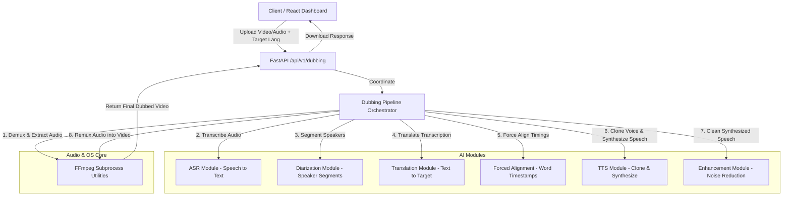

# Jupiter Sonic - Architecture & System Design 🪐🎙️

Jupiter Sonic is designed as a modular, local-first Speech Intelligence platform. The project avoids monolithic couplings to enable research, benchmarking, and quick substitutions of neural networks as open-source audio AI models advance.

---

## 📐 Clean Architecture Principles

1. **Separation of Concerns**: Core processing schemas, API routing, audio manipulation utilities, and neural network model execution are decoupled.
2. **Interface-Driven Design**: The AI core modules are defined by Python Protocols/Abstract Interfaces. API endpoints and orchestration pipelines only interact with interfaces, never concrete model wrappers.
3. **Dependency Injection**: Implementations are loaded and injected dynamically at startup, allowing toggles via environment variables (e.g., swapping a mock test module for a full CUDA-powered model).
4. **Local Execution**: Strict local execution. All files are processed locally on the system.

---

## 🧜‍♀️ Pipeline Execution Flow

Here is a visual map showing how a client request interacts with the FastAPI routes, which orchestrate multiple modular sub-processors to execute a complete **AI Dubbing Pipeline**:



---

## ⚙️ Module Interface Pattern

All capabilities in `backend/app/modules` implement standard base protocols. This is enforced using standard Python type hints and abstract classes:

```python
# app/modules/base.py
class ASRModuleInterface(ABC):
    @abstractmethod
    async def transcribe(self, audio_path: Path, language: Optional[str] = None) -> ASRResult:
        """Transcribe audio file into text with word-level timestamps."""
        pass
```

During application bootstrap (`app/main.py`), dependencies are resolved based on environment variables:

```python
# app/core/dependencies.py
def get_asr_module() -> ASRModuleInterface:
    if settings.ENABLE_ASR:
        if settings.ENV == "development":
            return MockASRModule()
        return LocalWhisperASRModule(model_id=settings.ASR_MODEL_ID)
    raise HTTPException(status_code=503, detail="ASR module is disabled")
```

---

## 🎛️ Audio Processing Stack

* **FFmpeg Wrapper**: Subprocess commands are executed safely via Python's standard `subprocess` API or `asyncio.create_subprocess_exec` to keep the event loop unblocked. Handles format conversions (e.g. converting uploaded mp4/webm to mono 16kHz WAV, which is standard for speech models).
* **librosa / SoundFile**: Used for loading float32 numpy arrays during real-time feature extraction or analysis of signal metrics (e.g. RMS volume detection).
